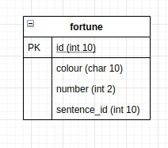

# Fortune Teller
_In response to the QAC group project._

# **Index**

[The Brief](#the-brief)

[Deployment](#deployment)

[Testing](#Testing)

[ERD](#entity-relationship-diagram)

[Technologies Used](#technologies-used)

[Credits](#credits)

## **The Brief**

The group final project will involve concepts from previous training modules. Python, CI, Cloud and Agile.
Create an application that generates objects making use of an Agile methodology such as the Scrum framework.
Create a micro-service orientated architecture for the application composed of at least 4 services that work together.
Service 1 will render Jinja2 templates, communicating with services 2, 3 and 4. The services should be able to be updated without disrupting the user experience.

# Entity Relationship Diagram

# **Testing**

Unit testing is done using Pytest.

## **Deployment**

Having considered various methods of deployment, we have initially containerised our working app using Docker deployed in the cloud on GCP, and later using the orchestration tool Docker Swarm on Azure.

### **Technologies Used**

*   Python - programming language
*   Flask - microframework
*   [Git](https://github.com/sarasiraj2009/fortune-teller) - VCS
*   [Trello](https://trello.com/b/a0Y3MSw8) - Project Tracking
*   Jenkins - CI server
*   Docker - container platform
*   Docker Compose
*   Docker Swarm - orchestration tool
*   Terraform - IaaS tool
*   Linux (Ubuntu) - OS
*   VS Code - IDE
*   HTML - programming language
*   GCP - Google Cloud Platform
*   Azure - Cloud Platform

## **Credits**

Project by Group 4: Andreas, Nida & Sara

A huge thank you to Ben & Luke as well as the supportive staff and our wonderful cohort at QA, UKFast & GMCA.

 <em> \
Document version <strong>1.0</strong></em>
